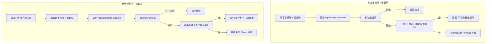

# 手机号注册/登录功能完备性检查与实现方案

> 检查日期：2026-04-27  
> 检查分支：`feat/phone-reigster-login`

---

## 一、功能实现状态总览

### 1.1 已实现功能（主体流程完整）

| 模块 | 功能点 | 状态 | 关键文件位置 |
|------|--------|------|-------------|
| **数据模型** | `User.Phone` 字段 + 索引 | 已完成 | `model/user.go:53` |
| | 手机号查重 / 按手机号查询用户 | 已完成 | `model/user.go:1051` |
| **短信服务** | 阿里云 SMS SDK 集成 | 已完成 | `sidecar/service/sms.go` |
| | 6 位数字验证码生成 | 已完成 | `common/verification.go:12` |
| | 验证码 10 分钟有效期 | 已完成 | `common/verification.go:34` |
| | 单手机号 60 秒发送间隔限流 | 已完成 | `sidecar/service/sms.go`（内存 sync.Map） |
| **后端接口** | `POST /api/sms/send` 发送验证码 | 已完成 | `sidecar/controller/sms.go` |
| | `POST /api/user/login/phone` 手机号登录 | 已完成 | `sidecar/controller/phone_auth.go` |
| | `POST /api/user/register/phone` 手机号注册 | 已完成 | `sidecar/controller/phone_auth.go` |
| | `POST /api/user/phone/bind` 绑定手机号 | 已完成 | `sidecar/controller/phone_auth.go` |
| | `PUT /api/user/phone/rebind` 换绑手机号 | 已完成 | `sidecar/controller/phone_auth.go` |
| **前端 UI** | 登录页手机号 Tab + 验证码 | 已完成 | `LoginForm.jsx:923` |
| | 注册页手机号 Tab + 验证码 | 已完成 | `RegisterForm.jsx:788` |
| | 个人中心绑定/换绑手机号 | 已完成 | `AccountManagement.jsx` |
| | 管理后台 SMS 配置面板 | 已完成 | `SystemSetting.jsx:1135` |
| **配置管理** | `SmsEnabled` 等 7 项配置 | 已完成 | `model/option.go:147` |
| | `sms_enabled` 状态暴露给前端 | 已完成 | `controller/misc.go:GetStatus()` |
| | localStorage 缓存 `sms_enabled` | 已完成 | `web/src/helpers/data.js:42` |
| **路由** | Sidecar 路由注册 | 已完成 | `router/api-router.go:380` |
| **i18n（后端）** | `MsgSMSSendFailed` | 已完成 | `i18n/keys.go` |

### 1.2 缺失/待完善项

| 模块 | 功能点 | 缺失程度 | 说明 |
|------|--------|---------|------|
| **短信服务商** | 腾讯云 SMS | TODO 空实现 | `TencentSMSProvider.Send()` 仅打印日志 |
| | Twilio SMS | TODO 空实现 | `TwilioSMSProvider.Send()` 仅打印日志 |
| **安全与校验** | 手机号格式正则校验 | 缺失 | 后端未校验手机号格式（如中国大陆 11 位） |
| | 注册时手机号唯一性防并发 | 存在竞态 | `IsPhoneAlreadyTaken` + `Create` 非原子操作 |
| **验证码存储** | 内存 map 存储 | 待优化 | 服务重启丢失，分布式部署不共享 |
| **业务功能** | 手机号找回密码/重置密码 | 缺失 | 无相关接口和 UI |
| **管理功能** | 用户列表搜索手机号 | 缺失 | `SearchUsers` 未包含 `phone` 字段 |
| **前端 i18n** | 大量 SMS/手机号 key 未翻译 | 缺失 | 6 个语言文件均缺少相关 key |
| **可靠性** | 短信发送失败重试 | 缺失 | 单次发送失败即返回错误 |

---

## 二、核心业务流程图

### 2.1 短信验证码发送流程

```mermaid
flowchart TD
    A[用户点击"获取验证码"] --> B{SmsEnabled?}
    B -->|否| C[返回: 短信服务未启用]
    B -->|是| D[检查 Turnstile 验证码]
    D -->|失败| E[返回: 人机验证失败]
    D -->|通过| F[检查 60s 发送间隔]
    F -->|冷却中| G[返回: 发送太频繁]
    F -->|通过| H[生成 6 位数字验证码]
    H --> I[写入内存 verificationMap<br/>key = purpose + phone]
    I --> J{SmsProvider?}
    J -->|阿里云| K[调用 dysmsapi 发送短信]
    J -->|腾讯云| L[TODO: 仅打印日志]
    J -->|Twilio| M[TODO: 仅打印日志]
    K --> N[返回: 发送成功]
    L --> N
    M --> N
```

### 2.2 手机号注册流程

```mermaid
flowchart TD
    A[用户填写手机号 + 验证码 + 可选密码] --> B[点击"注册并登录"]
    B --> C[检查 Turnstile 验证码]
    C -->|失败| D[返回错误]
    C -->|通过| E[校验短信验证码]
    E -->|错误/过期| F[返回: 验证码错误]
    E -->|正确| G[删除验证码]
    G --> H{手机号已存在?}
    H -->|是| I[返回: 手机号已被注册]
    H -->|否| J[检查邀请码有效性]
    J -->|无效| K[返回: 邀请码错误]
    J -->|有效| L[创建用户]
    L --> M[用户名 = phone_手机号<br/>手机号写入 Phone 字段]
    M --> N[建立登录 Session]
    N --> O[返回登录凭证]
```

### 2.3 手机号登录流程

```mermaid
flowchart TD
    A[用户填写手机号 + 验证码] --> B[点击"登录"]
    B --> C[检查 Turnstile 验证码]
    C -->|失败| D[返回错误]
    C -->|通过| E[校验短信验证码]
    E -->|错误/过期| F[返回: 验证码错误]
    E -->|正确| G[删除验证码]
    G --> H[按手机号查询用户]
    H -->|未找到| I[返回: 用户不存在]
    H -->|找到| J[检查用户状态]
    J -->|禁用| K[返回: 账号已封禁]
    J -->|正常| L[建立登录 Session]
    L --> M[返回登录凭证]
```

### 2.4 手机号绑定/换绑流程



---

## 三、缺失项实现方案

### 3.1 腾讯云 SMS 集成（优先级：P1）

**方案：**

1. 引入 SDK：`github.com/tencentcloud/tencentcloud-sdk-go/tencentcloud/sms`
2. 在 `sidecar/service/sms.go` 的 `TencentSMSProvider.Send()` 中实现：
   - 使用 `common.json.go` 中的 `common.Marshal()` 构造模板参数 JSON
   - 调用 `sms.NewClient()` 创建客户端
   - 调用 `SendSms` 接口发送
3. 配置项复用现有字段（`SmsAccessKeyId` -> SecretId，`SmsAccessKeySecret` -> SecretKey）

**代码结构：**
```go
func (t *TencentSMSProvider) Send(phone, code string) error {
    credential := common.NewCredential(t.AccessKeyId, t.AccessKeySecret)
    client, _ := sms.NewClient(credential, "ap-guangzhou", profile.NewClientProfile())
    req := sms.NewSendSmsRequest()
    req.PhoneNumberSet = common.StringPtrs([]string{phone})
    req.SignName = common.StringPtr(t.SignName)
    req.TemplateId = common.StringPtr(t.TemplateCode)
    req.TemplateParamSet = common.StringPtrs([]string{code})
    _, err := client.SendSms(req)
    return err
}
```

### 3.2 Twilio SMS 集成（优先级：P2）

**方案：**

1. 引入 SDK：`github.com/twilio/twilio-go`
2. 在 `sidecar/service/sms.go` 的 `TwilioSMSProvider.Send()` 中实现
3. Twilio 使用 `MessagingServiceSid` 或 `From` 号码作为发送方，签名和模板概念不同，需适配

### 3.3 手机号格式校验（优先级：P1）

**方案：**

在 `sidecar/controller/sms.go` 和 `sidecar/controller/phone_auth.go` 的入口增加校验：

```go
var phoneRegex = regexp.MustCompile(`^1[3-9]\d{9}$`) // 中国大陆手机号

func validatePhone(phone string) bool {
    return phoneRegex.MatchString(phone)
}
```

- 如果项目需要支持国际手机号，可使用 `github.com/nyaruka/phonenumbers` 库
- 建议将正则或库调用封装到 `common/phone.go`

### 3.4 注册时手机号唯一性防并发（优先级：P1）

**方案：**

**方案 A（推荐，最小侵入）：**
在 `sidecar/controller/phone_auth.go` 的注册逻辑中，利用 GORM 的 `uniqueIndex` 约束：

1. 在 `model/user.go` 中将 `Phone` 字段增加唯一索引（如果未添加）：
   ```go
   Phone string `json:"phone" gorm:"uniqueIndex" validate:"max=20"`
   ```
2. 注册时直接 `Create`，捕获 `gorm.ErrDuplicatedKey`（或数据库驱动返回的唯一性冲突错误）
3. 如果冲突，返回"手机号已被注册"

**方案 B（分布式锁）：**
使用 Redis 分布式锁（`SET phone:register:<手机号> NX EX 10`）保证同一手机号并发注册串行化。

### 3.5 验证码存储改为 Redis（优先级：P2）

**方案：**

将 `common/verification.go` 中的内存 `verificationMap` 替换为 Redis：

```go
func RegisterVerificationCodeWithKey(key, code, purpose string) {
    redisKey := fmt.Sprintf("verify:%s:%s", purpose, key)
    common.RedisSet(redisKey, code, time.Duration(common.VerificationValidMinutes)*time.Minute)
}

func VerifyCodeWithKey(key, code, purpose string) bool {
    redisKey := fmt.Sprintf("verify:%s:%s", purpose, key)
    stored, err := common.RedisGet(redisKey)
    if err != nil || stored != code {
        return false
    }
    common.RedisDel(redisKey) // 验证成功后删除
    return true
}
```

- 同时改造 `sidecar/service/sms.go` 中的发送限流 `sync.Map` 也改为 Redis

### 3.6 手机号找回密码/重置密码（优先级：P3）

**方案：**

1. **后端新增接口：**
   - `POST /api/user/password/reset/phone/send` — 发送重置密码验证码
   - `POST /api/user/password/reset/phone` — 校验验证码并重置密码
2. **前端新增页面/弹窗：**
   - 在 `LoginForm.jsx` 增加"忘记密码"入口
   - 新增 `ResetPasswordForm.jsx` 组件

**流程图：**
```mermaid
flowchart TD
    A[点击"忘记密码"] --> B[输入手机号]
    B --> C[获取验证码]
    C --> D[输入验证码 + 新密码]
    D --> E[提交重置]
    E --> F[校验验证码]
    F -->|失败| G[返回错误]
    F -->|成功| H[更新用户密码]
    H --> I[返回: 密码重置成功]
```

### 3.7 用户列表搜索手机号（优先级：P2）

**方案：**

在 `model/user.go` 的 `SearchUsers()` 或相关搜索函数中，将 `phone` 加入搜索字段：

```go
// 在搜索条件的 DB.Where 中增加
// db.Where("username LIKE ? OR email LIKE ? OR display_name LIKE ? OR phone LIKE ?", keyword, keyword, keyword, keyword)
```

### 3.8 前端 i18n 翻译补充（优先级：P1）

**方案：**

在以下翻译文件中补充缺失的 key（以 `zh.json` 为例，其他语言文件翻译对应内容）：

```json
{
  "手机号": "手机号",
  "请输入手机号": "请输入手机号",
  "请输入验证码": "请输入验证码",
  "请输入手机号和验证码": "请输入手机号和验证码",
  "验证码发送成功": "验证码发送成功",
  "验证码发送失败": "验证码发送失败",
  "注册并登录": "注册并登录",
  "注册成功！": "注册成功！",
  "注册失败，请重试": "注册失败，请重试",
  "登录成功！": "登录成功！",
  "登录失败，请重试": "登录失败，请重试",
  "配置短信登录": "配置短信登录",
  "启用短信登录": "启用短信登录",
  "短信服务商": "短信服务商",
  "阿里云": "阿里云",
  "腾讯云": "腾讯云",
  "Twilio": "Twilio",
  "AccessKey ID": "AccessKey ID",
  "AccessKey Secret": "AccessKey Secret",
  "短信签名": "短信签名",
  "短信模板代码": "短信模板代码",
  "模板变量名": "模板变量名",
  "保存短信设置": "保存短信设置",
  "短信服务商的 AccessKey ID": "短信服务商的 AccessKey ID",
  "敏感信息不会发送到前端显示": "敏感信息不会发送到前端显示",
  "已在平台审核通过的短信签名": "已在平台审核通过的短信签名",
  "短信模板代码，如 SMS_12345678": "短信模板代码，如 SMS_12345678",
  "阿里云模板中的变量名，默认为 code": "阿里云模板中的变量名，默认为 code",
  "后端会将其构造成 JSON 格式作为模板参数发送，如 {\"code\":\"123456\"}": "后端会将其构造成 JSON 格式作为模板参数发送，如 {\"code\":\"123456\"}",
  "用以支持通过手机号验证码进行登录注册": "用以支持通过手机号验证码进行登录注册",
  "短信服务商需要提前在对应平台申请签名和模板代码，模板中需包含 ${code} 变量": "短信服务商需要提前在对应平台申请签名和模板代码，模板中需包含 ${code} 变量"
}
```

### 3.9 短信发送失败重试（优先级：P3）

**方案：**

在 `sidecar/service/sms.go` 的 `Send()` 方法中增加简单重试（最多 3 次，间隔 1 秒）：

```go
func (s *SMSService) Send(phone, code string) error {
    var lastErr error
    for i := 0; i < 3; i++ {
        if i > 0 {
            time.Sleep(time.Second)
        }
        lastErr = s.provider.Send(phone, code)
        if lastErr == nil {
            return nil
        }
        common.SysLog(fmt.Sprintf("SMS send attempt %d failed: %v", i+1, lastErr))
    }
    return lastErr
}
```

---

## 四、开发优先级建议

| 优先级 | 事项 | 工作量 | 理由 |
|--------|------|--------|------|
| **P0（立即）** | 补充前端 i18n key | 小 | 影响多语言用户体验，代码中已引用但翻译文件缺失 |
| **P0（立即）** | 手机号格式校验 | 小 | 安全基础，防止无效请求和滥用 |
| **P0（立即）** | 注册防并发（唯一索引） | 小 | 数据一致性，避免同一手机号注册多个账号 |
| **P1（本周）** | 腾讯云 SMS SDK 集成 | 中 | 国内常用服务商，提升产品可用性 |
| **P1（本周）** | 验证码存储迁移到 Redis | 中 | 分布式/高可用环境必需 |
| **P2（后续）** | Twilio SMS 集成 | 中 | 面向海外用户 |
| **P2（后续）** | 用户列表搜索手机号 | 小 | 运营需求 |
| **P3（可选）** | 手机号找回密码 | 中 | 完善账号安全体系 |
| **P3（可选）** | 短信发送重试 | 小 | 提升发送成功率 |

---

## 五、Sidecar 侵入点汇总

当前所有对主代码的修改均在**白名单**内，符合 Sidecar 开发规范：

| 文件 | 修改内容 | 侵入程度 |
|------|---------|---------|
| `model/user.go` | User 结构体追加 `Phone` 字段 + 索引 | 最小 |
| `model/option.go` | `InitOptionMap()` / `updateOptionMap()` 追加 SMS 配置项 | 最小 |
| `router/api-router.go` | 末尾追加 `sidecarRouter.RegisterPhoneAuthRoutes(apiRouter)` | 最小 |
| `controller/misc.go` | `GetStatus()` 暴露 `sms_enabled` | 最小 |
| `controller/user.go` | 登录响应增加 `phone` 字段 | 最小 |
| `web/src/components/auth/LoginForm.jsx` | 追加手机号登录 Tab | 最小 |
| `web/src/components/auth/RegisterForm.jsx` | 追加手机号注册 Tab | 最小 |
| `web/src/components/settings/SystemSetting.jsx` | 追加 SMS 配置 Card | 最小 |
| `web/src/helpers/data.js` | 追加 `sms_enabled` localStorage | 最小 |

---

## 六、结论

**手机号注册/登录功能的主体流程已经完整实现**，包括：
- 后端短信发送、登录、注册、绑定/换绑接口
- 前端登录/注册/管理后台 UI
- 阿里云 SMS 实际可发送短信

**当前剩余的主要缺口是：**
1. 腾讯云/Twilio 的 SDK 仍为 TODO 空实现
2. 缺少手机号格式校验和注册防并发保护
3. 验证码存储在内存中（生产环境建议改用 Redis）
4. 前端 i18n 翻译文件缺失大量 key
5. 缺少手机号找回密码流程

建议按第四章的优先级逐步补齐，其中 P0 项（i18n、格式校验、防并发）建议在当前分支直接完成后再合并。
